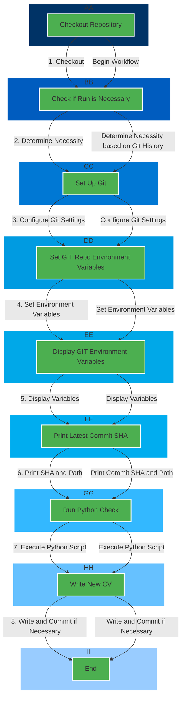

# [Action] To run create_CV 

The flow of the github action which run when a new commits are pushed to a branch. 

```mermaid
graph TD
  style AA fill:#003366,stroke:#ffffff,stroke-width:2px;
  style BB fill:#005cbf,stroke:#ffffff,stroke-width:2px;
  style CC fill:#0078d4,stroke:#ffffff,stroke-width:2px;
  style DD fill:#009be1,stroke:#ffffff,stroke-width:2px;
  style EE fill:#00a8e8,stroke:#ffffff,stroke-width:2px;
  style FF fill:#00adef,stroke:#ffffff,stroke-width:2px;
  style GG fill:#33b8ff,stroke:#ffffff,stroke-width:2px;
  style HH fill:#66c1ff,stroke:#ffffff,stroke-width:2px;
  style II fill:#99ccff,stroke:#ffffff,stroke-width:2px;

  A[Checkout Repository] -->|1. Checkout| B[Check if Run is Necessary]
  B -->|2. Determine Necessity| C[Set Up Git]
  C -->|3. Configure Git Settings| D[Set GIT Repo Environment Variables]
  D -->|4. Set Environment Variables| E[Display GIT Environment Variables]
  E -->|5. Display Variables| F[Print Latest Commit SHA]
  F -->|6. Print SHA and Path| G[Run Python Check]
  G -->|7. Execute Python Script| H[Write New CV]
  H -->|8. Write and Commit if Necessary| I[End]

  style A fill:#4CAF50,stroke:#ffffff,stroke-width:2px;
  style B fill:#4CAF50,stroke:#ffffff,stroke-width:2px;
  style C fill:#4CAF50,stroke:#ffffff,stroke-width:2px;
  style D fill:#4CAF50,stroke:#ffffff,stroke-width:2px;
  style E fill:#4CAF50,stroke:#ffffff,stroke-width:2px;
  style F fill:#4CAF50,stroke:#ffffff,stroke-width:2px;
  style G fill:#4CAF50,stroke:#ffffff,stroke-width:2px;
  style H fill:#4CAF50,stroke:#ffffff,stroke-width:2px;
  style I fill:#4CAF50,stroke:#ffffff,stroke-width:2px;

  A -->|Begin Workflow| B
  B -->|Determine Necessity based on Git History| C
  C -->|Configure Git Settings| D
  D -->|Set Environment Variables| E
  E -->|Display Variables| F
  F -->|Print Commit SHA and Path| G
  G -->|Execute Python Script| H
  H -->|Write and Commit if Necessary| I

  subgraph AA
    A
  end

  subgraph BB
    B
  end

  subgraph CC
    C
  end

  subgraph DD
    D
  end

  subgraph EE
    E
  end

  subgraph FF
    F
  end

  subgraph GG
    G
  end

  subgraph HH
    H
  end

  subgraph II
    I
  end
```
