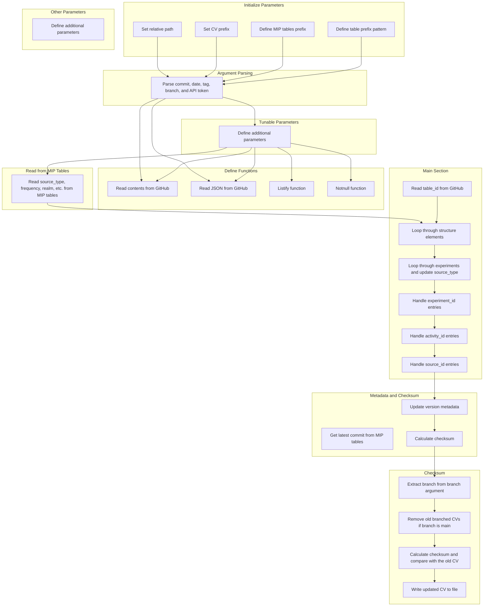

# [Py] Generate CV

The python script used to generate a cv. 

This is run by the action script [link here]. 


## Arguments

```
Create CV 
usage: create_cv.py [-h] [-c COMMIT] [-d DATE] [-t TAG] [-b BRANCH] [-a API]

Github action script to create CVs

options:
  -h, --help            show this help message and exit
  -c COMMIT, --commit COMMIT
                        Commit SHA
  -d DATE, --date DATE  date_commit
  -t TAG, --tag TAG     tag
  -b BRANCH, --branch BRANCH
                        branch
  -a API, --api API     api_token
```


## Program Flow

