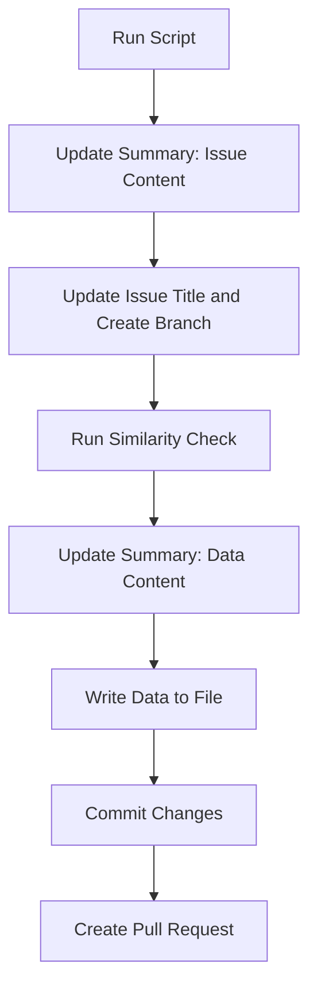

# A new submission story. 

In this section we outline the processing which happens in the background when a user supplies new information into the CVs. As a case study we shall explore what happens when we submit a new institution in the universal repository. 

## Issue Submission Form
The process starts with the submission of the relevant data. For this a user must find the relevant repository of the CVs provide all the required information to create such an entry. 

There are two planned routes for entering the required data: 
    - Github issue form
    - Dynamic website form

### GitHub form
Github issue templates can be used to guide input in the form of markdown files. More recently the option to use a yml file to create a form has been added. Using this we define an input form with relevant descriptions which once filled creates a formatted issue. 

For more information on the syntax (click here)[https://docs.github.com/en/communities/using-templates-to-encourage-useful-issues-and-pull-requests/syntax-for-githubs-form-schema]

#### Where are the issue forms?
Issue forms reside in the `.workflows/ISSUE_TEMPLATE/` directory. Here we explore the structure of the (`add_institution.yml`)[https://github.com/WCRP-CMIP/WCRP-universe/blob/Institution_UCLA/.github/ISSUE_TEMPLATE/add_institution.yml] template. The structure of this is described below: 

##### Issue Labels
Exploring the source code we can assign automatic labels for when the issue is created: 
```yaml
labels:
    - alpha
    - institution
```

##### Markdown
We also add a short markdown description 
```yaml

-   type: markdown
    attributes:
        value: |
            ####
            ## Adding a new Institution. 

            Please fill in the information below. 
```

##### Dropdown
And a dropdown to define what kind of action is required by the processing script. (Note although it is possible to determine this using labels, there are cases where conflicting labels may be used to identify issues that span several areas of interest, and therefore this is a more explicit method to do this.)

```yaml
-   type: dropdown
    id: category
    attributes:
        label: "Issue Type"
        #   description: "This is pre-set and cannot be changed."
        options:
            - "institution"
        default: 0
    validations:
        required: true
```

As this is a required value, it is also set to auto-populate with the first (0th) item. If we had an entry which could be added or modified, there may be multiple options within the issue type category selection. 

##### Inputs
Finally we define a set of inputs giving them a label, description in markdown, example text and whether or not the input is required for form submission. Unfortunately no further validation is possible within the github forms, and has to be carried out within the action described below. 

```yaml
-   id: label
    attributes:
        label: Acronym
        description: |
            A short acronym from which your institution can be identified with. 
            
            Note: This name must be unique across all organisations and cannot be changed once data is published with it.
        placeholder: 'e.g., UoYork, MOHC, CMIP-IPO'
    validations:
        required: true
    type: input
```
### Dynamic Web-Form
Although not currently available, the future plans is to replicate the web form on the mipcvs.dev server. This will constitute a fastAPI server which can access the suitability of a field as it is being entered. This will mean that any errors are flagged during entry, and do not require a review, edit, test loop. The end result from the website will still be the creation of a new issue, which upon submission triggers the same post-processing functions. 


## Submitting a new issue

To submit a new form we start by going to the Issues tab on github. 

<image>

Here if our template yml file is correctly formatted we should be able to select if from the list of available templates. 

<image>

From here we are able open the relevant form, completing any required fields. 


On submission, the pre-allocated labels are appended. 


## Workflow

When an issue is created or changed, we want to be able to run a series of scripts. These are called workflows. A workflow is defined in `.github/workflows`, with the components of the issue specific workflow (new_issue.yml)[https://github.com/WCRP-CMIP/WCRP-universe/blob/Institution_UCLA/.github/workflows/new_issue.yml] being outlined below. 

### Workflow content 

#### Triggers
The on section of a workflow outlines when an issue is run. Common triggers are on push, issue opened/closed, cron and dispatch. 
```yaml
on:
  issues:
    types: [opened, edited]
```
#### permissions
For workflows which need to interact with the repository, we need to define what the action is allowed to do. In this case, we can change the issue, repository content and create a pull request. 
```yaml
permissions:
  issues: write
  contents: write
  id-token: write
  pull-requests: write
```

#### Jobs
The next section defines the scripts which run. 
Instead of duplicating the same processing scripts in every repository we make use of reusable actions. These are modular workflows that work like functions, and can be located in a separate repository. 

```yaml
    steps:
      - name: Run the parser on a new issue
        id: new-issue-action
        uses: WCRP-CMIP/CMIP-LD/actions/new-issue@main
```

### Reusable Actions. 

The reusable action is located as part of the (CMIP-LD repository)[https://github.com/WCRP-CMIP/CMIP-LD/blob/main/actions/new-issue/action.yml]. 

Here the action begins by installing the cmipld python library
```yaml
    - name: cmip-ld library
        id: install-cmipld
        uses: WCRP-CMIP/CMIP-LD/actions/cmipld@main
      
```
We then checkout the repository, and run a set of python scripts. As the python scripts will need to access the issue submitter, its contents and id, we define this in the environmental variables. Finally we run the command line script `new_issue` as defined in the cmipld library.  

```yaml
      - name: Checkout repository
        uses: actions/checkout@v4

      - name: Run Python script
        id: run_python
        env:
          ISSUE_TITLE: ${{ github.event.issue.title }}
          ISSUE_BODY: |
              ${{ github.event.issue.body }}
          ISSUE_SUBMITTER: ${{ github.event.issue.user.login }}
          ISSUE_NUMBER: ${{ github.event.issue.number }}
          GH_TOKEN: ${{ github.token }}
          GITHUB_TOKEN: ${{ github.token }} # We need this to update the issue

        run: |
          new_issue
```

## CMIPLD command line scripts. 
When installing a python package, we are able to define entry-points. These are python functions which can be run as command line scripts. For example the `new_issue` command executes the `main` function from (`cmipld.generate.new_issue`)[https://github.com/WCRP-CMIP/CMIP-LD/blob/main/cmipld/generate/new_issue.py]. 

This starts by parsing the issue content: 
```python     
issue = get_issue()
parsed_issue = parse_issue_body(issue['body'])
```

We then use the issue_type category field to determine what script to run, and load it
```python 
issue_type = parsed_issue.get('issue_type', '')
script_path = f"{path}{issue_type}.py"

spec = importlib.util.spec_from_file_location(issue_type, script_path)
module = importlib.util.module_from_spec(spec)
spec.loader.exec_module(module)
```

Finally we execute the `run` function of the newly imported module and provide it with the issue content, and respective number. 
```python 
module.run(parsed_issue,issue)
```


## Issue specific script: Processing
The scripts for each issue will be placed in the `.github/ISSUE_SCRIPT/` directory and will have the same name as the issue_type (see above). 


```python
import sys
from pathlib import Path
import update_ror
import json, os
from cmipld.utils import git
from cmipld.tests import jsonld as tests
from cmipld.tests.jsonld.organisation import ror

path = './src-data/organisation/'

def similarity(name1, name2):
    from difflib import SequenceMatcher
    matcher = SequenceMatcher(None, name1, name2)
    similarity = matcher.ratio() * 100
    return similarity

def run(issue, packet):
    git.update_summary(f"## Issue content\n ```json\n{json.dumps(issue, indent=4)}\n```")
    ror = issue['ror']
    acronym = issue['acronym']
    id = acronym.lower()
    title = f'{issue["issue_type"].capitalize()}_{acronym}'
    git.update_issue_title(title)
    git.newbranch(title)
    acronym_test = tests.field_test(tests.components.id.id_field)
    ror_test = tests.field_test(tests.organisation.ror.ror_field)

    if ror != 'pending':
        tests.run_checks(acronym_test, {"id": id})
        tests.run_checks(ror_test, {"ror": ror})
        data = update_ror.get_institution(ror, acronym)
        ranking = similarity(issue['full_name_of_the_organisation'], data['long_label'])
        git.update_summary(f"## Similarity\nThe similarity between the full name ({issue['full_name_of_the_organisation']}) of the organisation and the long label ({data['long_label']}) is {ranking}%")
        if ranking < 80:
            git.update_issue(f"Warning: The similarity between the full name of the organisation and the long label is {ranking}%")
    else:
        tests.run_checks(acronym_test, {"id": id})
        data = {
            "id": f"{id}",
            "type": ['wcrp:organisation', f'wcrp:{issue["issue_type"]}', 'universal'],
            "label": acronym,
        }
    git.update_summary(f"## Data content\n ```json\n{json.dumps(data, indent=4)}\n```")
    outfile = path + id + '.json'
    json.dump(data, open(outfile, 'w'), indent=4)
    if 'submitter' in issue:
        os.environ['OVERRIDE_AUTHOR'] = issue['submitter']
    author = os.environ.get('OVERRIDE_AUTHOR')
    git.commit_one(outfile, author, comment=f'New entry {acronym} in {issue["issue_type"]} files.', branch=title)
    git.newpull(title, author, json.dumps(issue, indent=4), title, os.environ['ISSUE_NUMBER'])
```

### Mermaid Diagram

