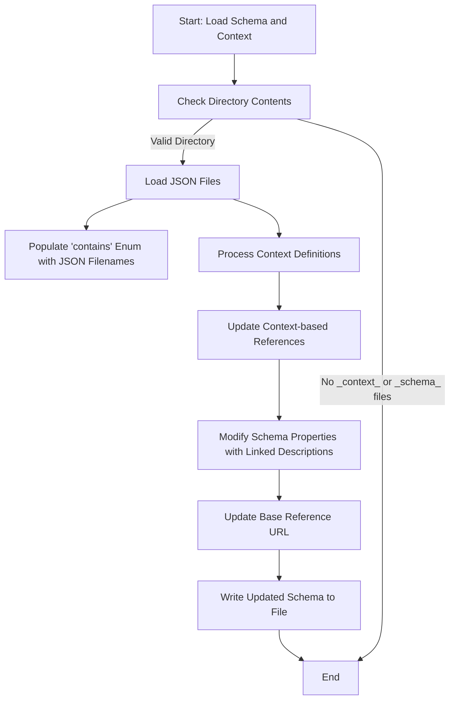
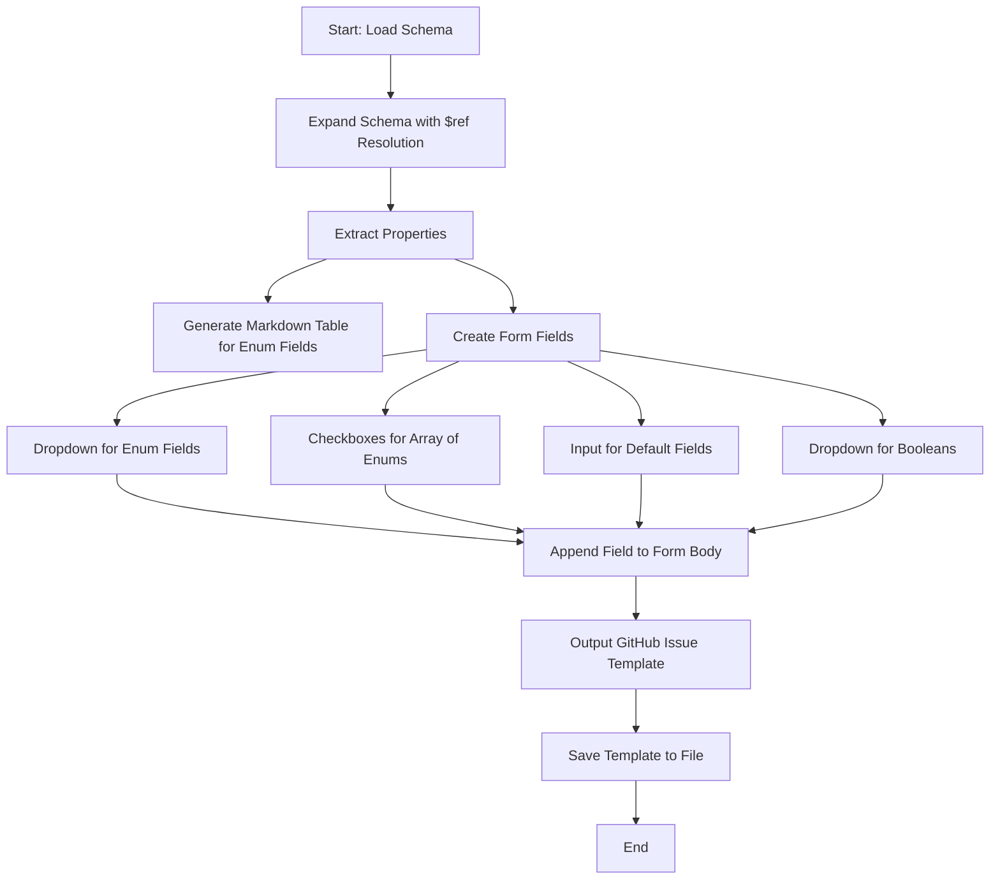

As mentioned in [Schema]('./Schema.md') the generation of issue templates has been automated:

##    Creating GitHub Issue Templates: A Simple Guide
The process of generating GitHub issue templates is like creating a smart, automated form-maker. Here's how it works:

### Updating the Schema
Much like JSON-LD it is possible to reference other JSON Schema fields using resolvable URL links. Using the context, we are able to locate the relevant `_schema_` files in other repositories, and extract and up to date list of permissable files (ie ones that do not break the links)

## Building the Template

Now we have an up to date and valid description (schema), it we want to turn it into a GitHub-friendly issue template.
To do this we can use the types defined in the schema to decides what type of input is needed: text boxes, dropdowns, checkboxes etc. 

Creating the Template

#### Schema Update Workflow

All generated templates are saved in the `.github/ISSUE_TEMPLATES` folder. From here github knows to offer the selection of newly generated forms to anyone wishing to submit a new item to the repository. 

An example google issue form generated by the YAML file:
<image src='/assets/demo_images/issue1.png'/>

## Special Fields 
We have added a few additional fields to the schema to ensure that it can be used for template generation. These are: 

## Additional work
In addition to the following we also need to run the 'create_labels' script from cmiplld in order for the designated labels to be available for each issue. 