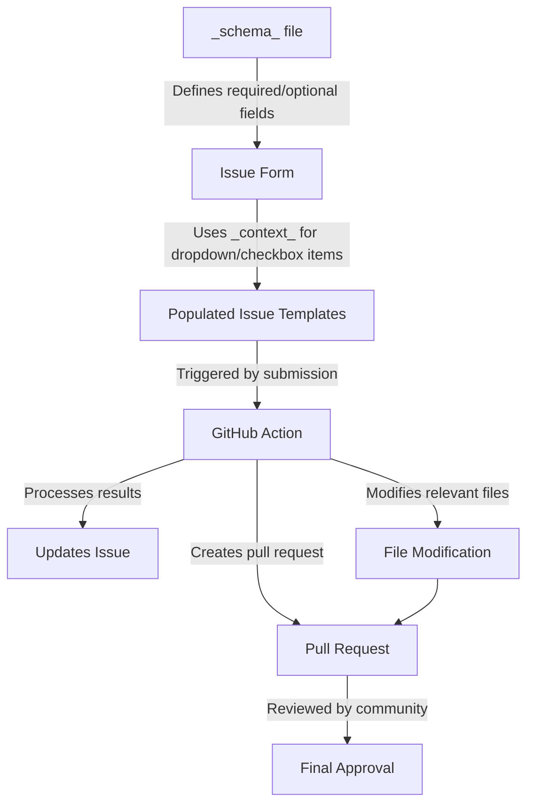

!!! tip "Documentation in progress"
    
    The schemas for each type still need to be defined. 
    For more rigorous checking of the contexts, Pydantic is used.  

JSON-schema is a method of validating the data presented within a JSON format. It is used to run CI checking of the data, as well as providing some additional features. Since JSON-LD is also valid JSON, all these checks should run as expected.   

## Validating json-ld files

To validate a file using the schema, we can run the following. 

```python

from cmipld.schema import validate
import requests

base = 'https://wcrp-cmip.github.io/WCRP-UNIVERSE/activity/'

data = requests.get(f'{base}cmip').json()
schema = requests.get(f'{base}_schema_').json()

assert validate(data,schema)

```

Alternatively there is also a pytest written to iteratively perform this function. 
(To be inserted here at a later point.)


## Issue templates 
Another use for the \_schema\_ file is that we can use it to build an issue form for the submission or modification of existing data. 
Here the `_context_` is used to create dropdown or checkbox items that need to be linked, and the schema defines additional information on which fields are optional or required. 

Once the issues templates are populated, a github action will process the results, update the issue, modify the relevant files and create a pull request for review by the community. 



For more information visit the [Issue Templates Page]('./Issue_templates.md')


## Restful-esque description of repository contents
Although the current files are statically hosted using GitHub pages, we are still able to produce a description of the repository, its contents and the various fields in the json-ld files. 

To accomplish this we leverage the use of JavaScript with the automatic 404 - not found page. Here we are able to check of a directory exists, and what it contains by examining the `_context_` and `_schema_` files. This is then used to produce a summary of the repository contents, links, and field types for the json ld.


(examples to be added here. )
